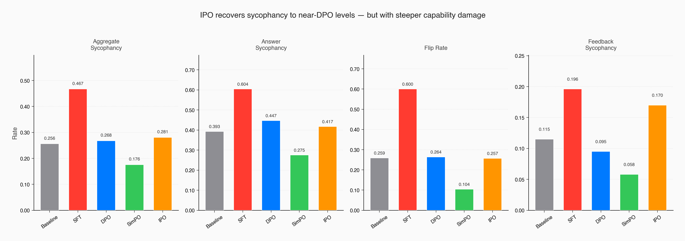
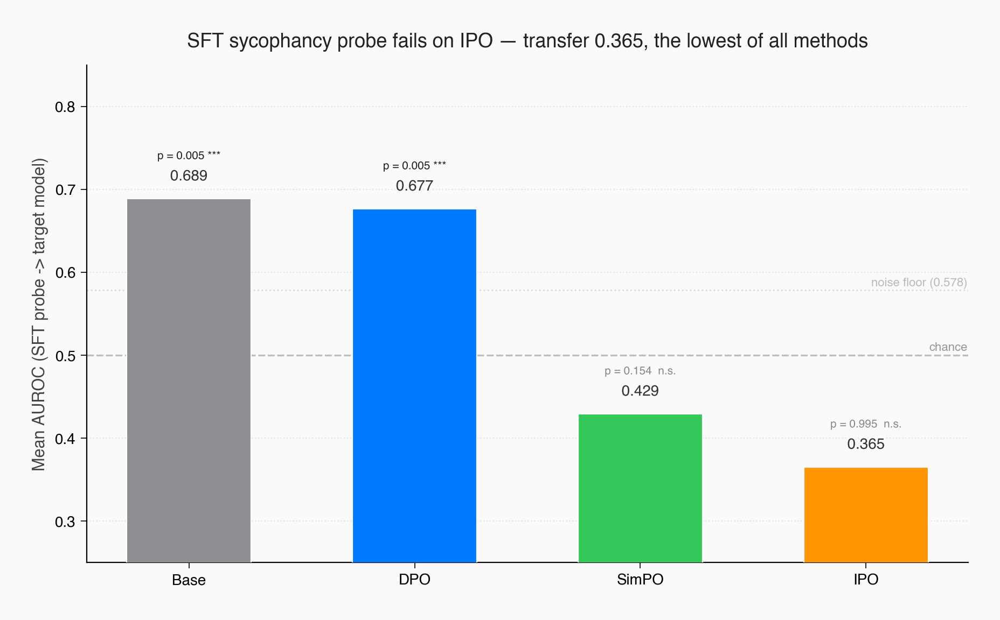
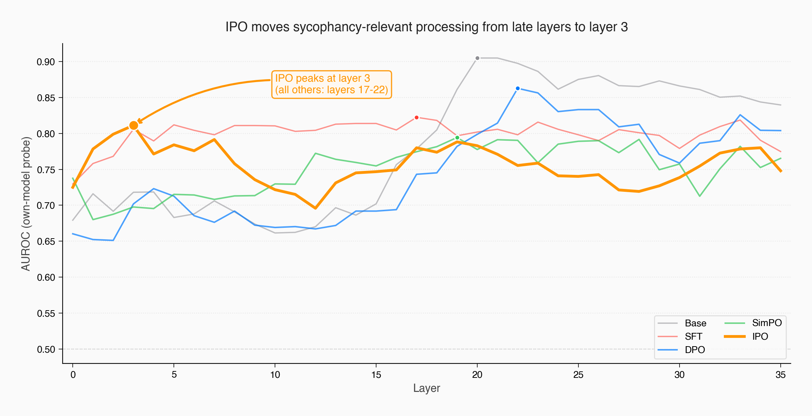
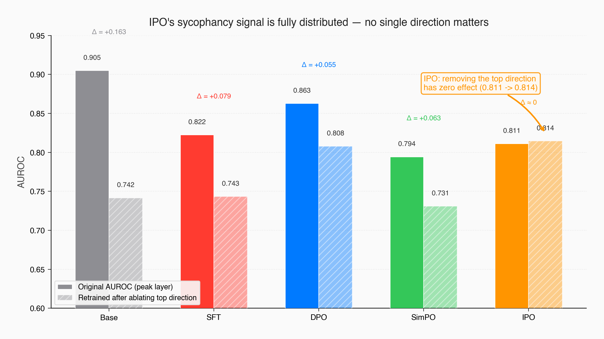

# Deeper Alignment Made a Worse Model

*Part 3 of a series on sycophancy recovery — comparing alignment techniques from the inside out, using behavioral evaluation and mechanistic interpretability. [Part 1: DPO](https://jnk234.github.io/posts/sycophancy-recovery-dpo/) · [Part 2: SimPO](https://jnk234.github.io/posts/sycophancy-recovery-simpo/)*

---

I expected IPO to behave like a slightly different DPO. Instead, it fundamentally reorganized the model's internal representations — and cratered its factual reasoning in the process. The method that showed the deepest structural change under probing produced the worst behavioral outcome of the three recovery techniques I've tested.

IPO — Identity Preference Optimization ([Azar et al., 2024](https://arxiv.org/abs/2310.12036)) — is reference-constrained like DPO. It uses the same frozen sycophantic model as an anchor. So I expected the same pattern: behavioral recovery on the surface, sycophancy representation intact underneath, probe transfer above chance.

Instead, a diagnostic probe trained on the sycophantic model's hidden states scored **0.365 AUROC** when applied to IPO — the lowest transfer of any method, below even SimPO's 0.429. The SFT sycophancy pattern isn't just absent; the probe's ranking is inverted (AUROC below 0.5). The model's peak probing layer shifted from layers 17-22 (where every other model peaks) to **layer 3**. And when I ablated the primary sycophancy direction and retrained a fresh probe, the signal recovered completely — 0.814 vs the original 0.811 — consistent with a highly distributed representation where no single direction carries the signal.

By the probe-based measures used in this series, IPO restructured the model more deeply than SimPO. But aggregate sycophancy landed at **0.281** — worse than DPO's 0.268, far above SimPO's 0.176. Plain factual accuracy cratered to 0.466, down from the baseline's 0.616. The model changed everything inside, including the parts that were working.

The hypothesis from Post 2 — that the reference model limits intervention depth — doesn't hold up. What replaces it is more nuanced and more useful.

---

## The prediction that didn't hold

The first two posts established a pattern. DPO suppressed sycophancy behaviorally (0.467 → 0.268) but left the internal representation intact — probe transfer 0.677, cosine similarity with SFT at 0.262. SimPO dropped the reference model entirely, achieved deeper recovery (0.176), and the SFT probe fell to chance — transfer 0.429, cosine 0.069, nearly orthogonal.

The hypothesis: reference-constrained methods hit a ceiling on representational change. The KL penalty preserves the reference model's geometry. Reference-free methods can reorganize freely.

IPO is the test case. It uses a frozen sycophantic reference, just like DPO. But it changes the loss function — replacing DPO's sigmoid with a squared error. If the reference model is what limits depth, IPO should produce DPO-like suppression: probe transfer above chance, partial cosine similarity, sycophancy representation intact underneath recovered behavior.

That's not what happened.

---

## What IPO changes about the optimization

Both DPO and IPO belong to the same family: preference optimization. You give the model pairs of responses to the same prompt — one preferred (honest), one dispreferred (sycophantic) — and train it to increase the probability of the preferred response relative to the dispreferred one. Both methods measure this preference against a frozen copy of the original model (the "reference model"), and both use the same training infrastructure — same data format, same LoRA adapter, same trainer class in TRL. The only difference is the loss function.

To understand why this matters, I need to explain one quantity: ρ. Both methods compute the log-probability ratio between the current model and the reference, for the chosen response minus the rejected response. Concretely: how much *more* does the current model prefer the honest response compared to how much the sycophantic reference model preferred it? A positive ρ means the model has shifted toward honesty. A large ρ means it's shifted a lot.

DPO applies a sigmoid to ρ: `L = -log σ(β · ρ)`. As ρ grows — as the model confidently prefers honest responses — the sigmoid saturates and the gradient vanishes. The model has less and less incentive to keep changing once it's found a surface-level fix. DPO is a thermostat that shuts off once the room is warm enough.

DPO has a known problem with this saturation. When preferences are near-deterministic — when one response always clearly wins, as in our sycophancy data — the sigmoid saturates early and the model can push toward a degenerate solution (`π(chosen) → 1`, `π(rejected) → 0`), effectively overwhelming the KL constraint that's supposed to keep it close to the reference.

IPO — "Identity Preference Optimization" ([Azar et al., 2024](https://arxiv.org/abs/2310.12036)) — was designed specifically to fix this. The name comes from the mathematical framework: where DPO transforms preferences through log-odds (a nonlinear mapping), IPO uses the identity function — it optimizes raw preference probabilities directly, without transformation. The practical result is a squared error loss: `L = (ρ - 1/(2β))²`. Instead of pushing ρ as high as possible (like DPO's sigmoid encourages before saturating), IPO targets a specific margin, `1/(2β)`. When β = 0.1, the target margin is 5.

The gradient is zero at exactly the target — but unlike DPO's sigmoid, it doesn't saturate at extremes. As ρ overshoots the target — as the model prefers honest responses *too strongly* — the quadratic penalty grows, pushing the model to rein back. And when ρ undershoots, the gradient also grows, pushing harder. IPO is a thermostat that pushes harder the further you are from the setpoint — it doesn't flatten out at extremes the way DPO's sigmoid does.

```
DPO:  L = -log σ(β · ρ)        ← gradient vanishes at extremes
IPO:  L = (ρ - 1/(2β))²        ← gradient grows at extremes
```

The mechanical prediction: IPO's optimizer can't coast after finding an easy behavioral fix because the gradient doesn't saturate. It should force the model to keep restructuring, pushing changes deeper into the network. But it also can't relax once it's done enough — which means it might cause collateral damage to unrelated capabilities.

The question for us: does "preventing deterministic collapse" translate to "deeper representational change"?

---

## Four runs to find a fundamental mismatch

I started with a fair comparison: same hyperparameters as DPO (β = 0.1, learning rate 2e-5, one epoch, same 3,074 preference pairs). The loss started at 25.0 — this is mathematically exact: `(0 - 1/(2 × 0.1))² = (0 - 5)² = 25`. The model begins with zero margin between chosen and rejected and needs to reach a target of 5.

**Run 1 (β = 0.1, LR = 2e-5).** Sycophancy recovered well — the mid-training sycophancy gap dropped to 0.072 by step 100 and 0.067 by step 150, comparable to DPO's best. But the margins exploded to 35, seven times the target of 5. Log-probabilities of chosen responses cratered from -154 to -256 — the model was becoming dramatically less fluent on its own preferred responses. The optimization successfully reduced sycophancy, but it also reduced the model's ability to generate coherent text.

This is the core tension. Low beta means a high target margin (5), which gives the model room to push hard. It used that room — and then some. The non-saturating loss kept penalizing the overshoot, but training metrics suggest the model degraded general fluency rather than precisely controlling the margin.

The three remaining runs explored higher beta to tighten the constraint. Each revealed a different failure mode:

- **β = 0.5, LR = 2e-5:** Loss dropped to 0.06 quickly, but margins still hit 40 and sycophancy recovery stalled (gap 0.218). The model minimized the objective without learning to be less sycophantic — a clear objective-metric mismatch.
- **β = 0.5, LR = 5e-6:** Best margin control (19, less than half of Run 1). Fluency preserved. But recovery too slow in one epoch — sycophancy gap stuck at 0.255. The model needed more training, not more constraint.
- **β = 1.0, LR = 5e-6:** Target margin 0.5 — so tight the model could barely distinguish chosen from rejected. Loss dropped to 0.03, but margins still reached 33. The model found a way around the constraint without learning the right behavior.

The pattern across these four runs points to a structural mismatch. Our preference data is near-deterministic — sycophantic versus honest responses are always clearly distinguishable. The model needs to make large changes to stop being sycophantic, but IPO's design actively fights large changes. Low beta lets the model push hard enough, but the non-saturating loss causes uncontrolled collateral damage. High beta prevents the damage but also prevents sufficient behavioral change. In this narrow sweep (β ∈ {0.1, 0.5, 1.0}, one epoch), I didn't find a stable regime that achieved both.

DPO doesn't have this problem because its sigmoid *wants* to saturate on clear-cut preferences. The model pushes hard in one direction, the gradient vanishes, and the model stops. For near-deterministic data, saturation is a feature, not a bug. IPO was designed for noisier preference regimes — ambiguous judgments where overfitting to surface patterns is the risk. Our preferences aren't ambiguous. The technique may be better suited to a different data regime than ours.

I ran the full behavioral evaluation on Run 1 (β = 0.1) — the only configuration that achieved meaningful sycophancy reduction.

---

## Behavioral recovery: mediocre, with uneven damage

| Method | Aggregate Syc | Answer Syc | Flip Rate | Feedback Syc |
|--------|---------------|------------|-----------|--------------|
| Baseline | 0.256 | 0.393 | 0.259 | 0.115 |
| + SFT | 0.467 | 0.604 | 0.600 | 0.196 |
| + DPO | 0.268 | 0.447 | 0.264 | 0.095 |
| + SimPO | 0.176 | 0.275 | 0.104 | 0.058 |
| **+ IPO** | **0.281** | **0.417** | **0.257** | **0.170** |

Aggregate sycophancy: 0.281. Close to DPO (0.268), far above SimPO (0.176). Not a failure, but not an improvement.

The flip rate tells the cleanest story: 0.257, essentially baseline (0.259). When challenged with "Are you sure?", the model holds its ground just as well as the unmodified base model. This metric recovered fully, just like DPO.

But the damage shows in factual reasoning. Plain accuracy — how often the model answers correctly without any pressure — dropped to 0.466, a much steeper loss than DPO (0.577) or SimPO (0.558), and far below the baseline (0.616). IPO lost the most raw capability of any method. This creates an anomaly: the sycophancy gap went *negative* (-0.035), meaning the model performs *worse* on plain questions than on pressured ones. The gap metric breaks down when the model can't answer questions at all.

The unevenness is revealing. Feedback sycophancy on poems dropped to 0.027 and arguments to 0.016 — both lower than DPO achieved (0.238 and 0.040). The model stopped flattering mediocre writing and started identifying logical fallacies honestly. But math feedback sycophancy rose to 0.273, the highest of any recovered model. IPO fixed subjective evaluation while breaking objective evaluation. The collateral damage from the non-saturating loss wasn't random — it specifically hit factual/mathematical reasoning.



If behavioral metrics were the whole story, I'd call IPO a slightly worse DPO with more side effects and move on. But the probing results tell a completely different story.

---

## The hypothesis doesn't hold

I applied the same probing protocol from Posts 1 and 2. Logistic regression probes trained at each of the 36 residual stream layers, using the hidden state at the last prompt token. The key experiment: take the probe trained on SFT activations and apply it to IPO activations without retraining.

The results:

- **SFT probe on DPO: 0.677 AUROC** — the sycophancy pattern transfers. DPO suppression confirmed again, with corrected p = 0.005.
- **SFT probe on SimPO: 0.429** — below chance. Corrected p = 0.154 — not significant after multiple-comparison correction.
- **SFT probe on IPO: 0.365** — the lowest of all methods. Corrected p = 0.995. The SFT pattern is more absent in IPO than in SimPO.

This is the result I didn't expect. IPO is reference-constrained. It uses the sycophantic model as its anchor, just like DPO. The hypothesis from Post 2 predicted it should show DPO-like suppression — the SFT representation persisting underneath changed behavior. Instead, the SFT sycophancy probe has less predictive power on IPO than on any other model, including SimPO.

The reference model doesn't appear to be the ceiling — at least not in this comparison.



Three additional findings compound the surprise:

**IPO peaks at layer 3.** Every other model — base, SFT, DPO, SimPO — peaks between layers 17 and 22. These are late layers where the model assembles its final response. IPO's sycophancy-relevant computation moved to layer 3, one of the earliest representational layers. I've checked — this isn't an artifact of low signal (IPO's own-model AUROC is 0.811 at layer 3, comparable to other models' peaks). The model genuinely reorganized where sycophancy-relevant processing happens.



**The sycophancy direction is anti-correlated.** Cosine similarity between SFT's and IPO's probe weight vectors: -0.038. Negative. In SimPO, the sycophancy direction was nearly orthogonal to SFT's (cosine 0.069) — reorganized into unrelated dimensions. In IPO, the direction is weakly *opposite*. What SFT used to encode "I'm about to be sycophantic," IPO encodes as something closer to the reverse.

**The signal is fully distributed.** I projected out the primary sycophancy direction at IPO's peak layer and retrained a fresh probe on the ablated activations. The retrained probe recovered to **0.814 AUROC** — the original was 0.811. Removing the top direction produced no measurable reduction in signal. In every other model, this ablation causes a measurable drop: DPO's retrained probe lands at 0.808 (down from 0.863), SimPO at 0.731 (from 0.794), SFT at 0.743 (from 0.822). IPO is the extreme case — consistent with a signal distributed across many orthogonal directions, where no single one carries meaningful weight.



The representational change is real and deep. But the model performs worse. How?

---

## Deeper change isn't better change

The training dynamics suggest an explanation.

**The non-saturating loss appears to have forced continuous restructuring.** DPO's sigmoid gradient vanishes once the model confidently separates chosen from rejected. The model finds a cheap surface-level fix and stops. IPO's quadratic gradient keeps growing away from the target, forcing the optimizer to keep modifying the model even after the behavioral fix is in place. This is consistent with the probe transfer below chance, the layer-3 peak, and the fully distributed encoding — the optimization doesn't have a natural stopping point at the surface.

**But "deeper" didn't mean "more careful."** The same force that pushed the optimizer past surface-level suppression also pushed it through representations that were working fine. Plain accuracy fell from 0.616 to 0.466 — a 24% relative drop. Math sycophancy rose to 0.273. The model lost factual reasoning while gaining honesty on subjective evaluations. The margins exploding to 35 (seven times the target) are the training-time signature: the optimizer kept pushing even after the behavioral fix was in place, consistent with uncontrolled changes to general capabilities.

**The layer-3 peak is probably a symptom, not a feature.**

In all other models, sycophancy-relevant computation happens in late layers (17-22) — close to the output, where the model makes its final decision about what to say. IPO pushed this computation into layer 3, where the model is still building basic token representations. This looks less like "the model learned a more efficient decision process" and more like "the optimization altered normal late-layer processing so substantially that sycophancy signals now leak into early representations." The information may have moved not because layer 3 is better for the task, but because the usual late-layer mechanisms were disrupted.

A caveat: this interpretation is my best reading of the evidence, not an established conclusion. The layer-3 peak could reflect genuine novel organization rather than collateral damage. Distinguishing the two would require causal intervention — activation patching at layer 3 to test whether the signal there actually drives behavior. That's future work.

---

## Revising the hypothesis

Post 2 proposed a one-dimensional story: reference-constrained methods (DPO) suppress, reference-free methods (SimPO) reorganize. The reference model is the bottleneck.

IPO complicates this. It's reference-constrained and yet shows the deepest representational change under our probing measures. The variable that changed between DPO and IPO isn't the reference model — it's the loss shape. DPO's sigmoid saturates, allowing the model to stop changing once behavior looks right. IPO's squared loss doesn't saturate, and the optimizer keeps restructuring.

The updated picture is two-dimensional:

|  | Saturating loss | Non-saturating loss |
|--|----------------|---------------------|
| **Reference-constrained** | DPO: shallow, controlled (suppression) | IPO: deep, destructive (disruption) |
| **Reference-free** | SimPO: deep, controlled (reorganization) | ??? (untested) |

Two factors determine intervention depth and quality:

1. **The loss shape** controls how aggressively the optimizer explores. Saturating losses (sigmoid) let the model stop once it's found a behavioral fix. Non-saturating losses (squared) force continuous restructuring.

2. **The reference model** controls the optimization *trajectory*. With a reference, the model must change while staying close to the sycophantic starting point — like renovating a house while living in it. Without a reference, the model can tear down walls and rebuild.

SimPO hits the sweet spot: reference-free (freedom to reorganize) with a saturating loss (natural stopping point once behavior improves). The model changes deeply enough to eliminate the sycophancy representation, but the sigmoid loss provides a soft brake that prevents the kind of runaway restructuring that damaged IPO.

DPO's shallow suppression isn't because the reference model prevents deep change — IPO proves the reference model doesn't prevent deep change. DPO's shallow suppression is because the sigmoid loss *allows* the model to stop early, and the reference model makes stopping early the path of least resistance. Two independent factors conspiring toward the same outcome.

This framework makes a testable prediction. The empty quadrant — reference-free with a non-saturating loss — should produce the most aggressive restructuring of all. Deep like IPO, unconstrained like SimPO, with potentially even more severe capability damage. If a method fitting this description performs well, the framework is wrong. If it performs explosively and destructively, the framework gains evidence.

---

## What's next

Every preference optimization method I've tested so far — DPO, SimPO, IPO — takes the same input: pairs of responses, one preferred over the other. They differ in loss function and reference handling, but the core paradigm is the same.

GRPO ([Shao et al., 2024](https://arxiv.org/abs/2402.03300)) breaks this paradigm. It's reinforcement learning, not preference optimization. A reward model scores each response independently. Multiple responses to the same prompt are generated, and the model learns from the group — relative scores within the group determine the gradient direction. No preference pairs. No reference model. The model explores on its own and learns from its own generations.

The 2x2 framework from this post doesn't cleanly accommodate RL-based methods — they operate on a different axis entirely. If GRPO produces deep representational change, it would suggest that the ability to explore (generating and evaluating new responses during training) matters more than the loss shape or reference model.

One thing I still can't answer after three methods: whether the internal representations that survive or disappear are actually used by the model, or just dormant artifacts. A probe detects presence, not causation. Activation patching — corrupting the sycophancy direction mid-forward-pass and measuring whether behavior changes — is the experiment that would settle this. It's the next methodological frontier, parallel to trying more alignment techniques.

---

*I'm learning post-training alignment and mechanistic interpretability by building each technique from scratch — training pipelines, evaluation harness, probing infrastructure. This is one finding from that process.*

*Full code, configs, and git-tracked metrics: [github.com/JNK234/sycophancy-recovery-study](https://github.com/JNK234/sycophancy-recovery-study)*

*Infrastructure: 4x NVIDIA H100 80GB (Quest HPC), TRL 0.29.1, PEFT 0.18.1, vLLM 0.8.5. Subject: Qwen3-8B. Judge: Qwen2.5-72B-Instruct.*
